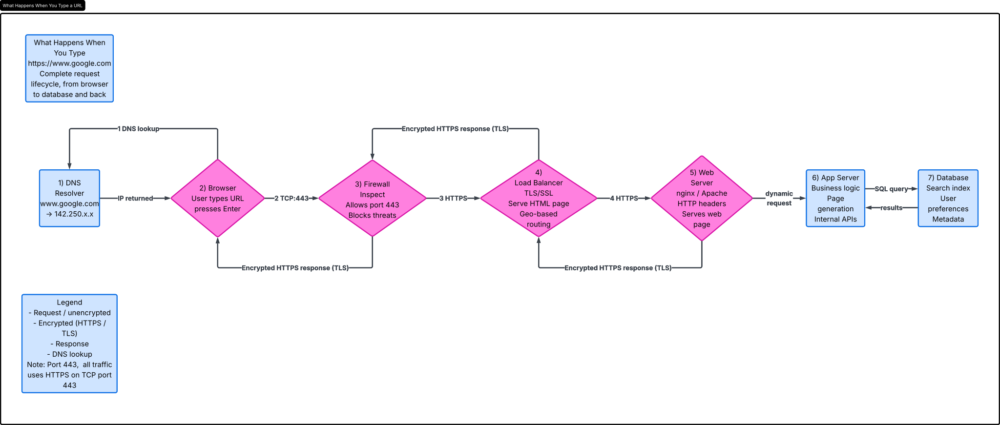

# What Happens When You Type https://www.google.com in Your Browser and Press Enter

**Published URL:** https://medium.com/@12119_57011/what-happens-when-https-s3-eu-west-3-amazonaws-com-hbtn-intranet-project-files-holbertonschoo-36245bc2e27f

When you type https://www.google.com and press Enter, a sequence of network, security, and server-side systems work together to retrieve the page.

## 1. DNS request

The browser first needs to find the IP address for www.google.com. It checks the local DNS cache, then the system hosts file, and finally asks the configured DNS resolver. The resolver may use recursive queries to root, TLD, and authoritative name servers until it gets an answer. The result is one or more IP addresses for Google's servers.

## 2. TCP/IP

With the server IP known, the browser starts a TCP connection to port 443. TCP uses a three-way handshake: SYN, SYN-ACK, ACK. The packets travel over IP through routers and switches across networks. Each hop forwards the IP packet toward Google’s data center using the internet’s routing tables.

## 3. Firewall

Firewalls on the client network, the internet path, or Google's edge can inspect the traffic. They typically allow outbound HTTPS traffic on port 443 and block unauthorized ports or suspicious packets. The firewall ensures only valid connections are permitted and can drop malformed TCP/IP packets.

## 4. HTTPS/SSL

Once the TCP session is established, the browser initiates the TLS handshake for HTTPS. The server presents a certificate proving it owns google.com. The browser verifies the certificate chain, validates the trusted certificate authority, and agrees on encryption keys. After the TLS handshake, the HTTP request is encrypted inside the secure channel.

## 5. Load-balancer

Google uses load balancers to handle massive incoming traffic. The request likely reaches a global load balancer or edge proxy first. The load balancer distributes requests to healthy backend servers and optimizes latency by choosing a nearby data center or the best available server.

## 6. Web server

The selected web server accepts the HTTPS request and interprets the HTTP headers. It can handle static assets and route dynamic requests. For the google.com homepage, the web server may serve cached HTML or forward the request to an application server if it needs user-specific content.

## 7. Application server

The application server contains the logic for search, page generation, and user interfaces. It processes the request, executes business rules, and may call internal APIs. When needed, it queries backend systems like the database to retrieve search suggestions, personalization data, or configuration settings.

## 8. Database

Databases store the structured data needed by application servers. For a search engine, this includes indexes, user preferences, and metadata. The application server sends queries to the database, receives results, and uses that data to build the final web page.

After the application server prepares the response, the web server sends it back over the secure TLS session. The browser receives the encrypted response, decrypts it, and renders the page. This completes the process of loading https://www.google.com.

# What happens when you type `https://www.google.com` and press Enter

When you type `https://www.google.com` in your browser and press Enter, the request flow includes DNS resolution, encrypted HTTPS traffic, firewall traversal, load balancing, web server handling, application server page generation, and database access.

Published URL: https://medium.com/@12119_57011/everythings-better-with-a-pretty-diagram-146855c801c7?postPublishedType=repub

Flow schema:
- Browser starts with DNS resolution for `www.google.com`.
- DNS returns the server IP address.
- The browser connects to the server IP on port `443` using HTTPS.
- The traffic is encrypted with TLS.
- Encrypted traffic passes through a firewall.
- The request is distributed by a load balancer.
- The load balancer forwards the request to a web server.
- The web server forwards application logic to the application server.
- The application server may request data from the database.
- The application server generates the web page.
- The web server serves the generated web page back to the browser.
