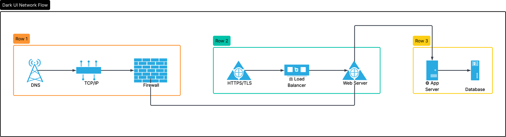
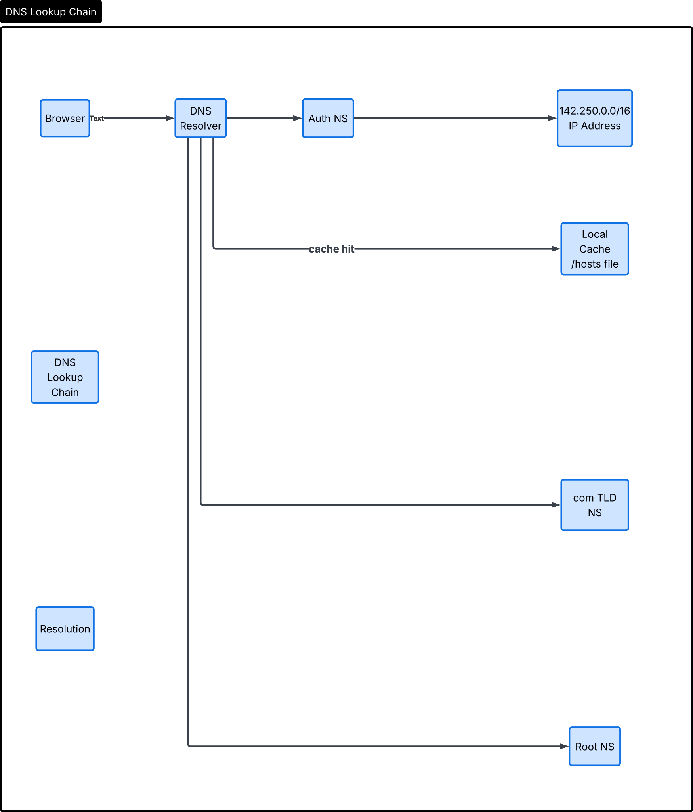
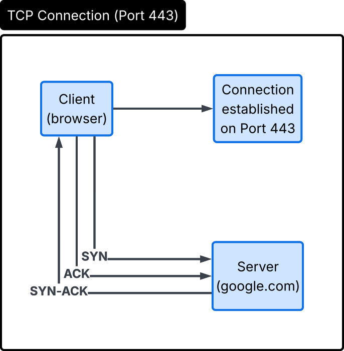
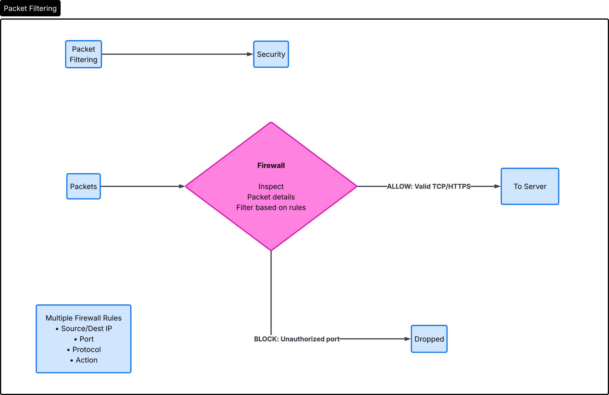
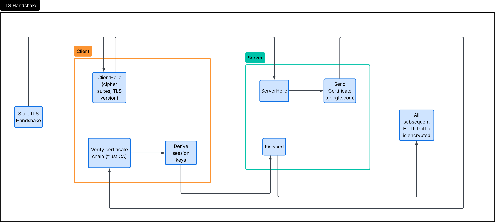
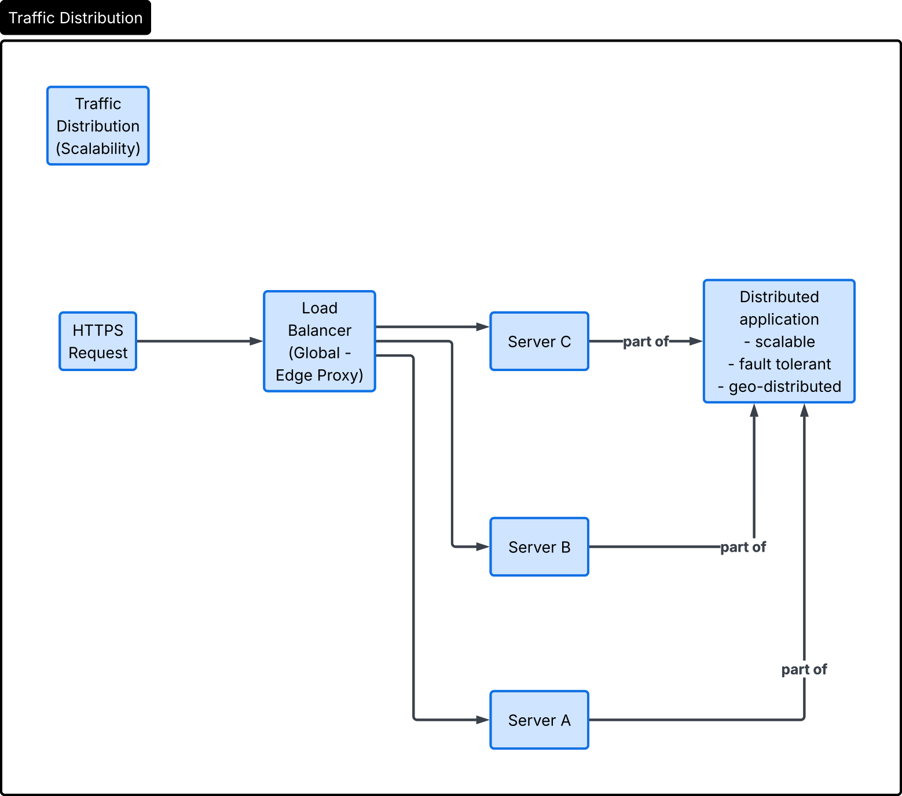
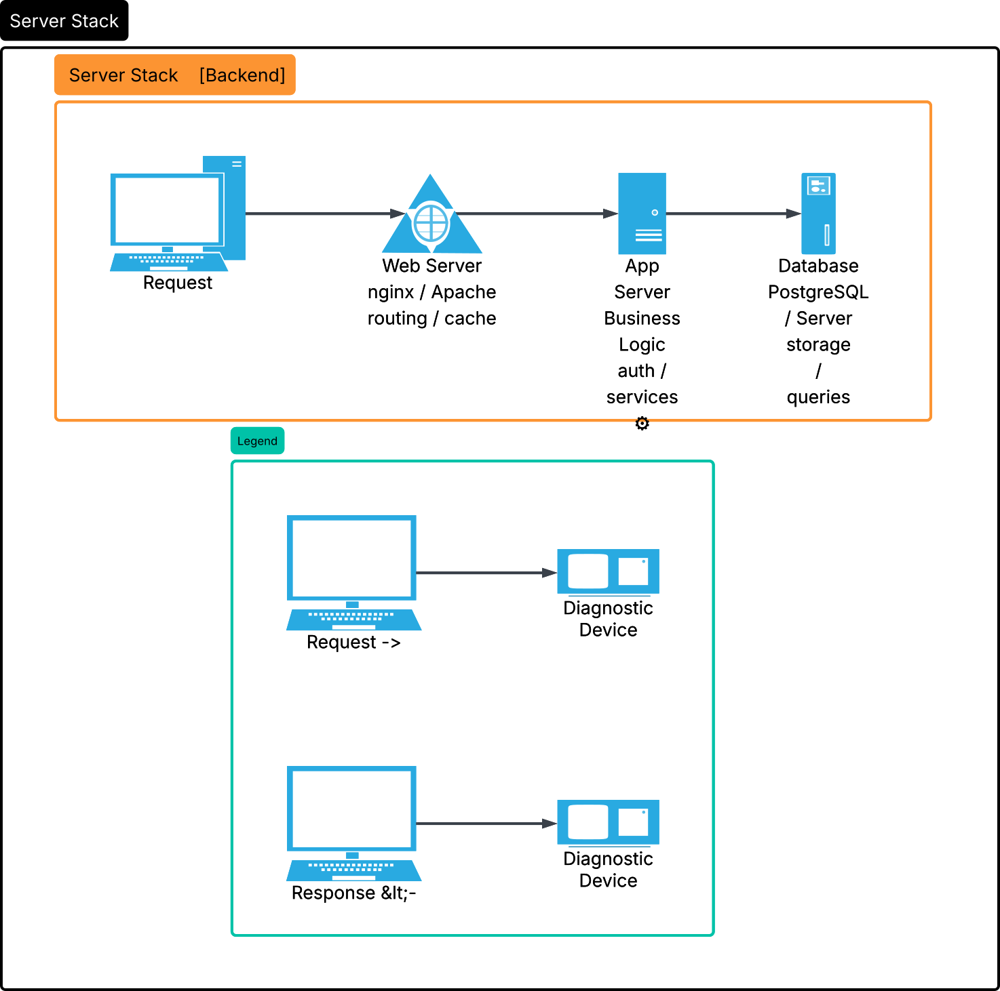

# What Happens When You Type https://www.google.com in Your Browser and Press Enter

## Task 0 :

**Published URL:** https://medium.com/@12119_57011/what-happens-when-https-s3-eu-west-3-amazonaws-com-hbtn-intranet-project-files-holbertonschoo-36245bc2e27f

When you type https://www.google.com and press Enter, a sequence of network, security, and server-side systems work together to retrieve the page.

## 1. DNS request

The browser first needs to find the IP address for www.google.com. It checks the local DNS cache, then the system hosts file, and finally asks the configured DNS resolver. The resolver may use recursive queries to root, TLD, and authoritative name servers until it gets an answer. The result is one or more IP addresses for Google's servers.

## 2. TCP/IP

With the server IP known, the browser starts a TCP connection to port 443. TCP uses a three-way handshake: SYN, SYN-ACK, ACK. The packets travel over IP through routers and switches across networks. Each hop forwards the IP packet toward Google’s data center using the internet’s routing tables.

## 3. Firewall

Firewalls on the client network, the internet path, or Google's edge can inspect the traffic. They typically allow outbound HTTPS traffic on port 443 and block unauthorized ports or suspicious packets. The firewall ensures only valid connections are permitted and can drop malformed TCP/IP packets.

## 4. HTTPS/SSL

Once the TCP session is established, the browser initiates the TLS handshake for HTTPS. The server presents a certificate proving it owns google.com. The browser verifies the certificate chain, validates the trusted certificate authority, and agrees on encryption keys. After the TLS handshake, the HTTP request is encrypted inside the secure channel.

## 5. Load-balancer

Google uses load balancers to handle massive incoming traffic. The request likely reaches a global load balancer or edge proxy first. The load balancer distributes requests to healthy backend servers and optimizes latency by choosing a nearby data center or the best available server.

## 6. Web server

The selected web server accepts the HTTPS request and interprets the HTTP headers. It can handle static assets and route dynamic requests. For the google.com homepage, the web server may serve cached HTML or forward the request to an application server if it needs user-specific content.

## 7. Application server

The application server contains the logic for search, page generation, and user interfaces. It processes the request, executes business rules, and may call internal APIs. When needed, it queries backend systems like the database to retrieve search suggestions, personalization data, or configuration settings.

## 8. Database

Databases store the structured data needed by application servers. For a search engine, this includes indexes, user preferences, and metadata. The application server sends queries to the database, receives results, and uses that data to build the final web page.

After the application server prepares the response, the web server sends it back over the secure TLS session. The browser receives the encrypted response, decrypts it, and renders the page. This completes the process of loading https://www.google.com.

## Task 1 :

When you type `https://www.google.com` in your browser and press Enter, the request flow includes DNS resolution, encrypted HTTPS traffic, firewall traversal, load balancing, web server handling, application server page generation, and database access.

Published URL: https://medium.com/@12119_57011/everythings-better-with-a-pretty-diagram-146855c801c7?postPublishedType=repub

The flow, left to right:

DNS Resolver : The browser first does a DNS lookup: it asks “what’s the IP address for www.google.com?" and gets back something like 142.250.x.x. Names are for humans; the network needs the number.

Browser : With the IP in hand, the browser opens a TCP connection on port 443 (the standard port for encrypted HTTPS traffic).

Firewall : The request passes through a firewall that inspects traffic, allows port 443, and blocks anything it considers a threat. It forwards the legitimate HTTPS request onward.
Load Balancer : This handles TLS/SSL (the encryption handshake) and decides which server should handle you, using geo-based routing to send you to a nearby data center and spread load across machines.

Web Server (nginx / Apache) : Manages HTTP headers and serves the web page. Static content it can return directly; anything dynamic it passes on as a “dynamic request.”
App Server :Runs the business logic: generates the page, calls internal APIs, and queries the database when it needs data.

Database : Holds the search index, user preferences, and metadata. It runs the SQL query and returns results back to the app server.

The return trip: the response travels back the same chain in reverse — the curved arrows labeled “Encrypted HTTPS response (TLS)” show the data flowing back through the web server, load balancer, firewall, and finally to your browser, encrypted the whole way.

A couple of notes on the diagram’s conventions:

The legend (bottom-left) distinguishes request/unencrypted hops, encrypted HTTPS/TLS hops, responses, and the DNS lookup. The pink diamonds (browser, firewall, load balancer, web server) are the decision/processing points along the path, while the blue boxes are the endpoints (DNS, app server, database). The note reminds you that all the main traffic runs over HTTPS on TCP port 443.

One small technical caveat: the diagram labels the browser→firewall hop as plain “TCP:443,” but in reality the encryption (TLS) is established right at the start of that connection, so traffic is encrypted from the browser onward, not only on the return trip.

Tommy JOUHANS, Student of Holberton School at Dijon, From France.
